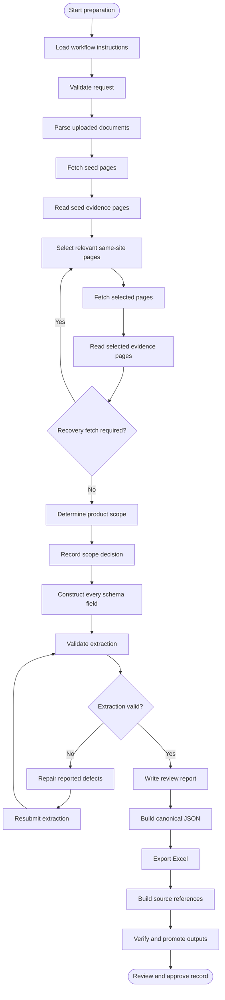

# Visit Finland DataHub Product Preparation Assistant

## Introduction

This application creates evidence-grounded Visit Finland DataHub records for tourism products, including Accommodation and Shops, from website URLs and optional PDF or DOCX files. It produces reviewable JSON, Excel, Markdown, and source-reference artifacts. It does not submit records automatically.

Tourism-related organizations need to upload this information to the Visit Finland DataHub, now operated by Business Finland, so their products are discoverable. Preparing it in the required format is time-consuming; this tool streamlines that work.

The user selects a product type, such as Accommodation or Shops, and supplies one or more URLs with optional PDF or DOCX files. The tool analyzes and combines the source evidence, determines the product scope (such as the specific accommodation or shop represented) using predefined scope schemas, performs structured extraction against the selected product schema, validates the record, and prepares outputs for entry into the DataHub.

## Architecture

| Component | Responsibility |
| --- | --- |
| `frontend/` | Next.js interface for starting, monitoring, reviewing, and approving runs |
| `app/api.py` | FastAPI service for runs, events, artifacts, approval, and deletion |
| `app/runner_optimized.py` | Claude Agent SDK workflow |
| `app/agent_tools.py` | Typed tools, evidence pagination, budgets, and finalization |
| `visit-finland-datahub-accommodation/SKILL.md` | Workflow instructions and extraction rules |
| `visit-finland-datahub-accommodation/scripts/` | Retrieval, parsing, validation, and export |
| `runs/` | Isolated run workspaces and output artifacts |

## Workflow diagram



## Workflow steps

- Start preparation
- Load workflow instructions
- Validate request
- Parse uploaded documents
- Fetch seed pages
- Read seed evidence pages
- Select relevant same-site pages
- Fetch selected pages
- Read selected evidence pages
- Perform a recovery fetch, if required
- Determine product scope
- Record the scope decision
- Construct every schema field
- Validate extraction
- Repair reported defects, if required
- Resubmit repaired extraction
- Write the review report
- Build canonical JSON
- Export Excel
- Build source references
- Verify and promote outputs
- Review and approve the record

## Request workspace

```text
runs/<run-id>/
|-- input/
|   |-- request.json
|   `-- documents/
|-- work/
|   |-- source-manifest.json
|   |-- parsed-documents.json
|   |-- fetched-pages.json
|   |-- context-delivery.json
|   |-- pages/
|   |-- scope-decision.json
|   |-- extraction-draft.json
|   `-- staging-output/
`-- output/
    |-- result.json
    |-- canonical-product.json
    |-- result.xlsx
    |-- review-report.md
    |-- sources.json
    |-- run-manifest.json
    |-- scope-decision.json
    `-- approved-product.json
```

Output files are created only when applicable. Successful runs promote verified artifacts to `output/` and remove transient source content. `sources.json` contains sanitized metadata for cited websites and uploaded documents.

## Prerequisites

- Python 3.12 or compatible Python 3
- Bun and a Node.js version supported by Next.js 16
- Claude Code CLI available on `PATH`
- Microsoft Foundry access for the configured Claude model

Install dependencies:

```powershell
# From the repository root
python -m pip install -r requirements.txt

cd frontend
bun install
cd ..
```

## Environment

Create `.env` in the repository root:

```dotenv
CLAUDE_CODE_USE_FOUNDRY=1
ANTHROPIC_FOUNDRY_RESOURCE=<your-resource-name>
ANTHROPIC_FOUNDRY_API_KEY=<your-api-key>
ANTHROPIC_MODEL=claude-sonnet-5
MAX_CONCURRENT_RUNS=2
API_TIMEOUT_MS=600000
CLAUDE_CODE_MAX_RETRIES=2
DISABLE_TELEMETRY=1
```

Create `frontend/.env.local`:

```dotenv
NEXT_PUBLIC_API_BASE_URL=http://127.0.0.1:8010
```

Optimized workflow mode and nested Claude sessions are application defaults. Do not commit credentials.

## Run the application

Backend:

```powershell
# From the repository root
python -m app.main --preflight
python -m uvicorn app.api:app --host 127.0.0.1 --port 8010
```

Frontend, in a second terminal:

```powershell
cd frontend
bun dev
```

Open <http://localhost:3000>. API documentation is available at <http://127.0.0.1:8010/docs>.

CLI:

```powershell
python -m app.main --website-url "https://example-hotel.fi"
```

Repeat `--website-url` and `--document` for multiple inputs. Avoid Uvicorn `--reload` on Windows.

## API

| Method | Path | Purpose |
| --- | --- | --- |
| `POST` | `/runs` | Start a run |
| `GET` | `/runs` | List runs |
| `GET` | `/runs/{run_id}` | Get status and artifacts |
| `GET` | `/runs/{run_id}/events` | Stream progress with SSE |
| `POST` | `/runs/{run_id}/cancel` | Cancel a run |
| `GET` | `/runs/{run_id}/artifacts/{name}` | Download an artifact |
| `POST` | `/runs/{run_id}/approve` | Save an approved record |
| `DELETE` | `/runs/{run_id}` | Delete a run |

Terminal statuses: `completed`, `scope_ambiguous`, `no_usable_sources`, `validation_failed`, `execution_failed`, `input_invalid`, `cancelled`, and `interrupted`.

## Test

```powershell
# From the repository root
python -m pytest

cd frontend
bun run typecheck
bun run lint
bun run build
```

Default tests use fixtures and mocks; they do not call live websites or Foundry.

